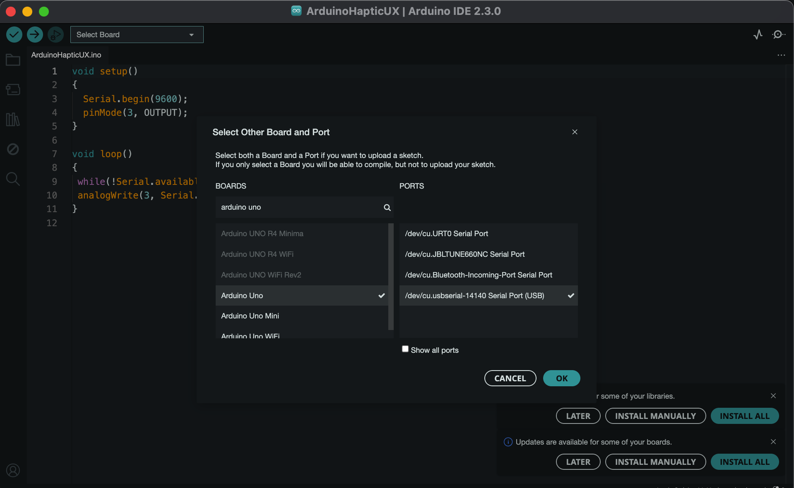
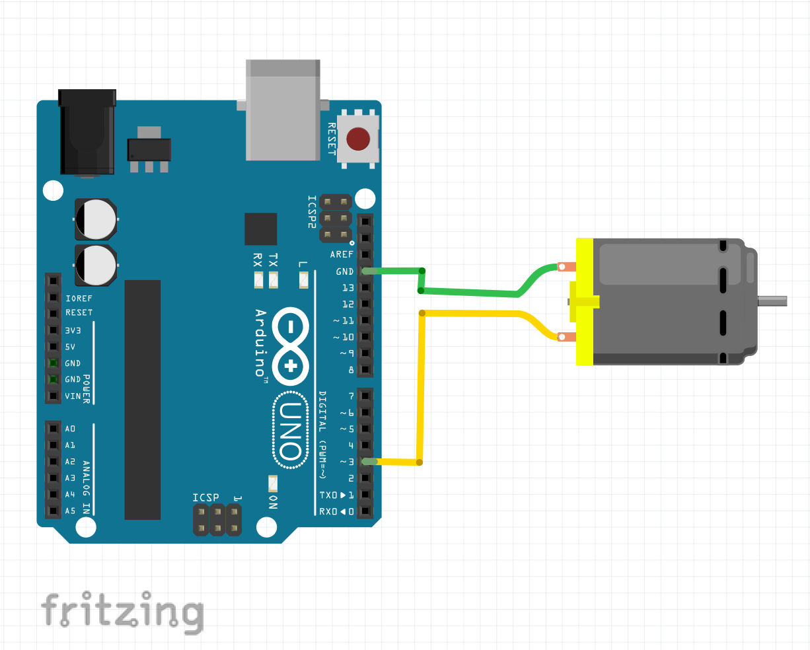
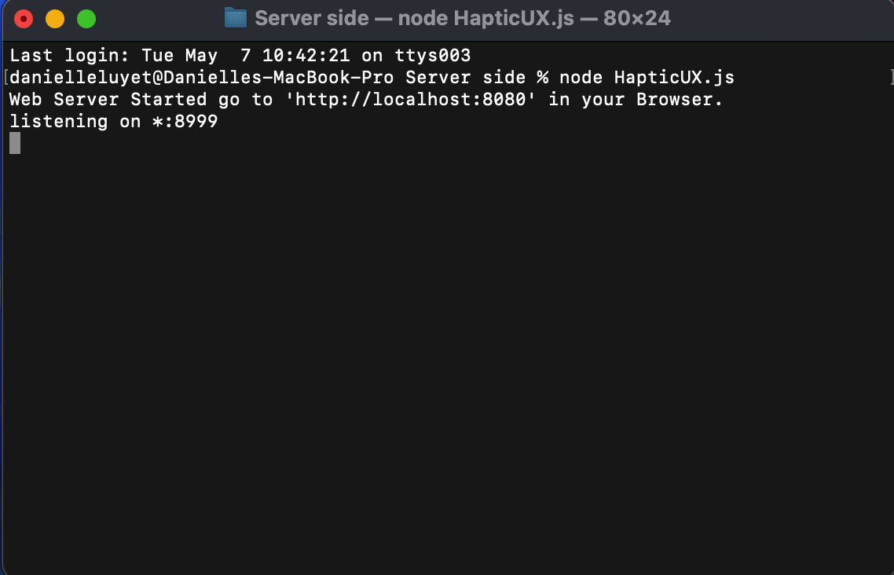
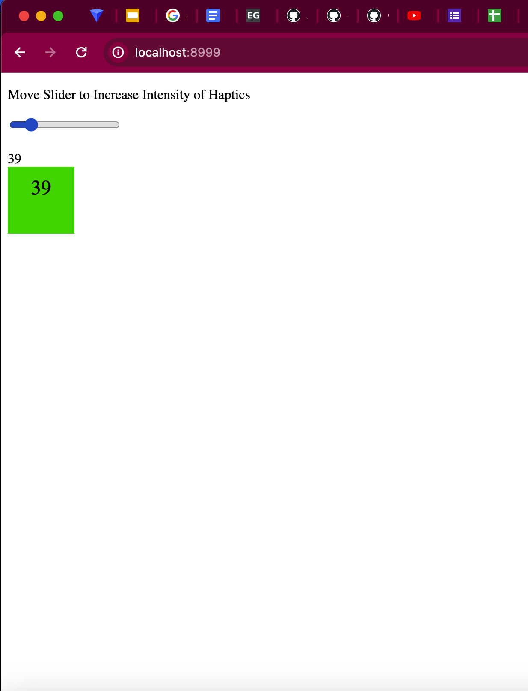
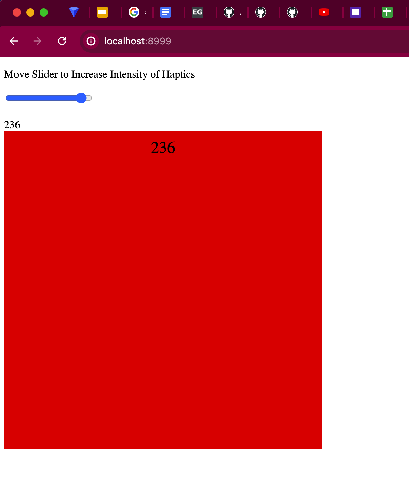

# Haptic Website

## Introduction
This project aims to create a haptic interaction system for a website using Node.js, Johnny-Five, Firmata, Express, Socket.io, and Serialport. The system allows a webpage to communicate with an Arduino board, enabling users to experience a variable haptic intensity effect based on an HTML slider and a simple graphic interface. In the future, different haptic effects based on hover and click actions will be implemented.

## Contents
`HapticUX.zip` contains 3 main folders:

### Arduino Code
The Arduino Code folder contains the sketch `ArduinoHaptic.ino` which will allow the Arduino to receive information from the Node.js server. The Additions folder provides other useful example sketches for further development: the Firmata protocol, the Firmata protocol with BLE enabled, and a basic example sketch for the haptic driver chip DRV2605.

### Server Side
The Server side folder contains `HapticUX.js`, the backend JavaScript that creates and hosts the haptic UX website locally, as well as communicates data from the website to the Arduino.

### Client Side (Inside the Server Side folder)
The client side folder contains `index.html` and `style.css` and is referenced by the server to build a website for haptic interaction.

## Required Components
- Arduino Uno
- DC Coreless Motor 7x25 mm 1.5-3v or any small haptic motor.
- Jumper wires & breadboard

## Setup
1. Ensure you have Node.js installed on your computer. You can download Node.js for Microsoft Windows and macOS from this [link](https://nodejs.org/en/download/). 
2. If you do not already have the Arduino IDE installed on your computer, download it from this [link](https://www.arduino.cc/en/software)
3. Install Dependencies: Install the required packages in the **Server Side** folder by opening a terminal in the Server side folder and running these commands:


```bash
npm install johnny five
npm install express
npm install socket.io
npm install serialport

```

## Preparing the Arduino for Communicating with the Host Computer
1. Open the arduino IDE with the sketch `ArduinoHaptic.ino` which can be found in the folder **Arduino Code**
2. Set up the Arduino UNO board & identify the serial port you are using 


For example, the serial port I am using is 
```bash
/dev/cu.usbserial-14140
```
If you are using windows or another operating system besides MacOS, then your port name will differ. Save the name of this port for later. 

3. Plug the DC motor terminals into Arduino UNO's PWM pin 3 and and GND. 


5. Upload the sketch and **close** the Arduino IDE.


## Edit the `HapticUX.js` Script 
1. Use any text editor (or your prefered one, IMO Visual Studio Code) to open and edit `HapticUX.js`


3. On line 11, change '/dev/cu.usbserial-14140' to the port name you identified ealier using the arduino IDE.
4. Save the `HapticUX.js` 

## Running the Server
Start the Node.js server by opening a terminal in the **Server side** folder and running:
```bash
node HapticUX.js
```


## Open a Web browser at local host 8999
1. type localhost:8999 in the URL bar of your web browser
```bash
localhost:8999
```
2. Move the slider and watch the square change size and color as the haptics intensify



## How It Works

The Node.js server communicates with the webpage using Socket.io, enabling real-time interaction.
Johnny-Five and Serialport are used to establish communication between the Node.js server and the Arduino board.
The Firmata protocol acts as an intermediate protocol between the Arduino and the host computer, allowing the JavaScript app to drive different haptic effects for hover and click actions.

## Contributors

Danielle Luyet
Special thanks to Nikhil Agnihotri who wrote this tutorial on “How to build a Node.js server to control Arduino from a webpage”
